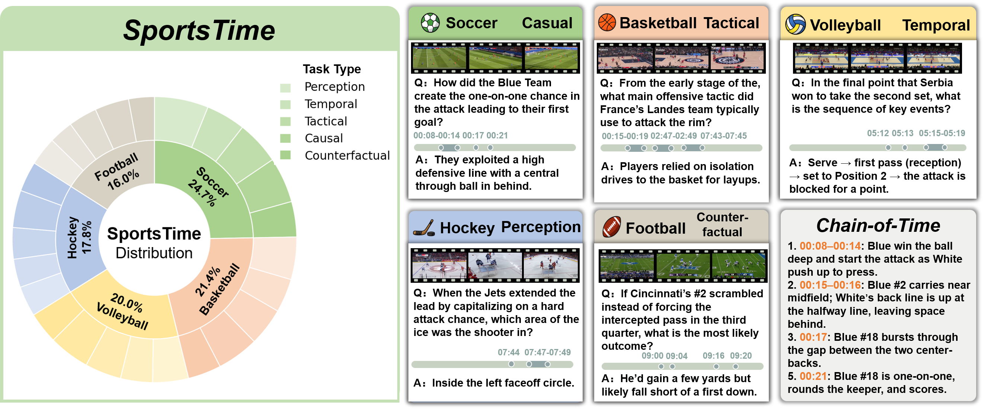
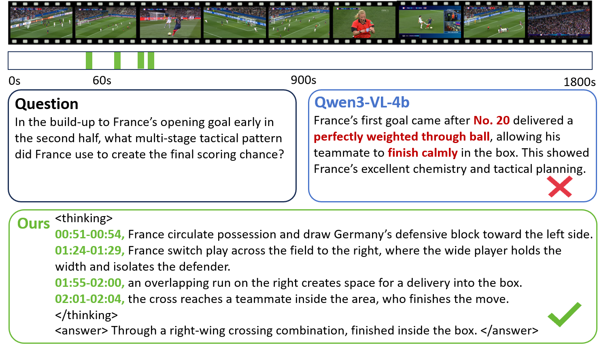
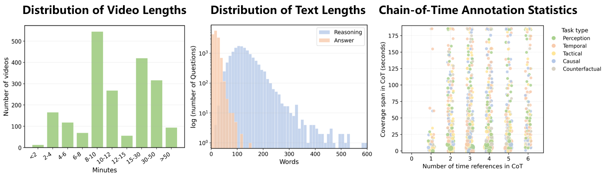

<h1 align="center">
  &nbsp;SportsTime
</h1>

<p align="center">
  <strong>Towards Temporal Compositional Reasoning in Long-Form Sports Videos</strong>
</p>
<p align="center">
  Siyu Cao &middot; Lu Zhang<sup>&dagger;</sup> &middot; Ruizhe Zeng &middot; Zhi-yong Liu<sup>&dagger;</sup>
</p>
<p align="center">
  School of Artificial Intelligence, UCAS &middot; MAIS, Institute of Automation, CAS
</p>
  <p align="center">
    <a href="http://arxiv.org/abs/2604.22226"></a>
    <a href="LICENSE"></a>
    
    
    
  </p>
</p>

---

## News

- **[2026-04]** Paper available on [arXiv](http://arxiv.org/abs/2604.22226).
- **[2026-04]** QA annotations, evaluation code, and benchmark data released.
- **[2026-04]** Video access requests are handled through the [request form](#videos).

---

**SportsTime** is a large-scale benchmark for temporal compositional reasoning in long-form sports videos.
It contains **14,326** open-ended QA pairs with **50,000+** step-wise temporal evidence annotations (Chain-of-Time) across five team sports and **1,575** videos.

<p align="center">
  
</p>
<p align="center">
  <em>Overview of SportsTime: five sports, five reasoning types, and Chain-of-Time annotations with step-wise temporal evidence.</em>
</p>

## Why SportsTime?

Current MLLMs struggle with long-horizon reasoning in sports videos — answering questions often requires tracing a sequence of events (e.g., passes, movements, tactical shifts) that unfold across minutes of footage. Existing benchmarks either focus on short clips, lack temporal evidence annotations, or use multiple-choice formats that don't reflect real-world analytical demands.

SportsTime addresses these gaps with questions that require **identifying, localizing, and composing evidence from multiple temporally separated events**, each grounded by explicit timestamps.

<p align="center">
  
</p>
<p align="center">
  <em>Chain-of-Time reasoning enables temporally grounded, verifiable answers — unlike standard models that rely on language priors and produce plausible but unsupported responses.</em>
</p>

## Key Features

- **14,326 open-ended QA pairs** across 1,575 videos (208 full matches + 1,367 highlights)
- **50,000+ step-wise temporal evidence annotations** — each reasoning step is grounded with a timestamp or time span
- **5 team sports**: Basketball, American Football, Ice Hockey, Soccer, Volleyball
- **5 reasoning types**: Perception, Temporal, Tactical, Causal, Counterfactual
- **Expert-guided semi-automatic annotation** with two-stage manual review
- **Dual-track evaluation**: LLM-as-Judge for open-ended QA + Step-wise Grounding Alignment (SGA)

<p align="center">
  
</p>
<p align="center">
  <em>Dataset statistics: video length distribution, text length distribution, and Chain-of-Time annotation statistics.</em>
</p>

## Dataset Structure

We provide **bilingual** (Chinese and English) annotations. The data format is identical across both versions.

```
data/                           # Chinese (original)
├── basketball/
│   ├── full_game.json
│   └── highlight.json
├── football/
│   ├── full_game.json
│   └── highlight.json
├── hockey/
│   ├── full_game.json
│   └── highlight.json
├── soccer/
│   ├── full_game.json
│   └── highlight.json
└── volleyball/
    ├── full_game.json
    └── highlight.json

data_en/                        # English
└── (same structure as above)
```

Each sport has two splits: `full_game` (complete match recordings, ~50 min) and `highlight` (edited highlight clips, ~10 min).

## Data Format

Each QA sample is a JSON object:

| Field | Type | Description |
|---|---|---|
| `id` | `string` | Unique sample identifier |
| `video_id` | `string` | Associated video identifier |
| `task_type` | `string` | Reasoning category (Perception / Temporal / Tactical / Causal / Counterfactual) |
| `question` | `string` | Open-ended question |
| `CoT` | `string` | Chain-of-thought reasoning with step-wise temporal evidence |
| `answer` | `string` | Ground-truth answer |
| `time_refs` | `array` | Temporal anchors for each reasoning step, with `type` (`ts` or `span`) and timestamp/span values |

<details>
<summary><b>Click to see an example</b></summary>

```json
{
  "id": "Basketball_Full_001_1_1",
  "video_id": "Basketball_Full_001_1",
  "task_type": "Causal",
  "question": "At the start of the game, what was the most direct cause of Warriors #30 fouling Thunder #35?",
  "CoT": "1. At 01:48, Thunder #35 holds the ball beyond the three-point line.\n2. At 01:49, Thunder #12 sets a screen for #35.\n3. At 01:50, #35 uses the screen to drive toward the paint.\n4. At 01:52, Warriors #30 fails to navigate the screen, making body contact with #35.\n5. At 01:53, the referee whistles a foul on #30.",
  "answer": "Warriors #30 was caught on the screen while defending",
  "time_refs": [
    {"type": "ts", "ts": "01:48"},
    {"type": "ts", "ts": "01:49"},
    {"type": "ts", "ts": "01:50"},
    {"type": "ts", "ts": "01:52"},
    {"type": "ts", "ts": "01:53"}
  ]
}
```

</details>

## Evaluation

We provide a unified evaluation entry point and individual scripts under [`eval/`](eval/). See [`eval/README.md`](eval/README.md) for details.

```bash
# Full pipeline: judge → per-task accuracy → SGA
python eval/evaluate.py \
  --pred_jsonl predictions.jsonl \
  --gt_dir data/ \
  --judge_model_path /path/to/Qwen2.5-VL-7B-Instruct

# Already judged, just compute metrics
python eval/evaluate.py \
  --pred_jsonl predictions.judged.jsonl \
  --gt_dir data/ \
  --skip_judge
```

Individual scripts are also available:

| Script | Description |
|---|---|
| `eval/evaluate.py` | Unified entry point (runs all steps below) |
| `eval/judge.py` | LLM-as-Judge scoring (Qwen2.5-VL / Qwen3-VL) |
| `eval/sga_eval.py` | Step-wise Grounding Alignment: Anchor(%), mIoU, H@0.5 |
| `eval/task_accuracy.py` | Per-task-type accuracy breakdown |
| `eval/judge_consistency.py` | Inter-judge agreement (Cohen's & Fleiss' kappa) |

## Videos

The video files (~750GB, 1,575 videos) are provided for research purposes after manual review.

To request access, please fill out the private [SportsTime Video Access Request Form](https://docs.google.com/forms/d/e/1FAIpQLSe13-x_y5eKap9Ic-u9rJt9dqJrAiqupKmAclkQzMRkAixXYg/viewform).

We will review requests and provide access instructions manually. Please use the videos only for non-commercial research or educational purposes, and do not redistribute the video files or private access links.

## Citation

If you use SportsTime in your research, please cite our paper:

```bibtex
@article{cao2026sportstime,
  title   = {Towards Temporal Compositional Reasoning in Long-Form Sports Videos},
  author  = {Cao, Siyu and Zhang, Lu and Zeng, Ruizhe and Liu, Zhi-yong},
  journal = {arXiv preprint arXiv:2604.22226},
  year    = {2026}
}
```

## License

This dataset is released under the [CC BY-NC 4.0](LICENSE) license.
